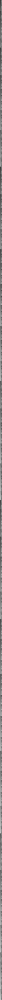

# computational-rock
mingus+mido hacking

| --- |--- | --- | --- | --- |--- | --- | --- | --- |--- | --- | --- | --- |--- | --- |
|  |  |  |  |  |  |  |  |  |  |  |  |  |  |  |  |

<table>
<tr>
<th>01</th>
<th>02</th>
<th>03</th>
<th>04</th>
<th>05</th>
<th>06</th>
<th>07</th>
<th>08</th>
<th>09</th>
<th>10</th>
<th>11</th>
<th>12</th>
<th>13</th>
<th>14</th>
<th>15</th>
</tr>
<tr>
<td>

</td>
<td>

</td>
<td>

</td>
<td>

</td>
<td>

</td>
<td>

</td>
<td>

</td>
<td>

</td>
<td>

</td>
<td>

</td>
<td>

</td>
<td>

</td>
<td>

</td>
<td>

</td>
<td>

</td>
<td>

</td>
</tr>
</table>