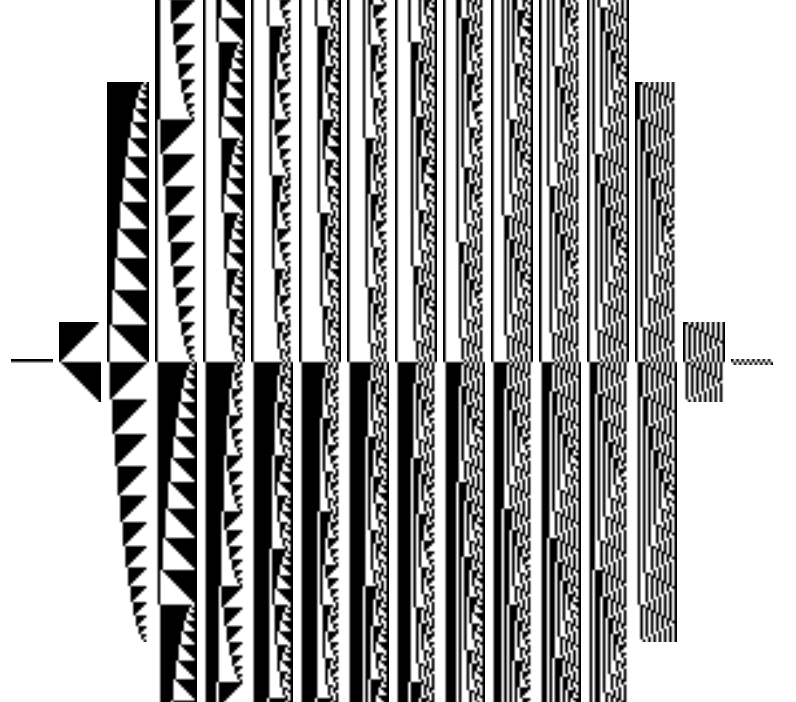
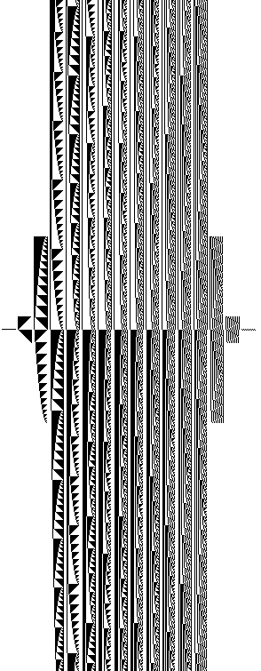
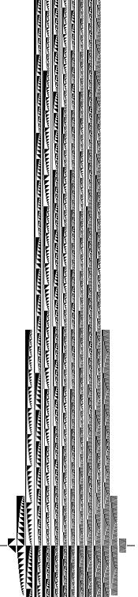
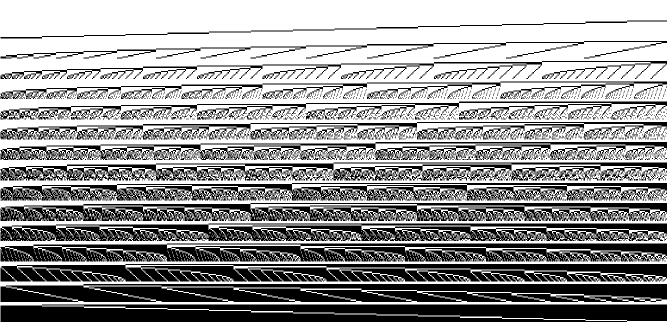
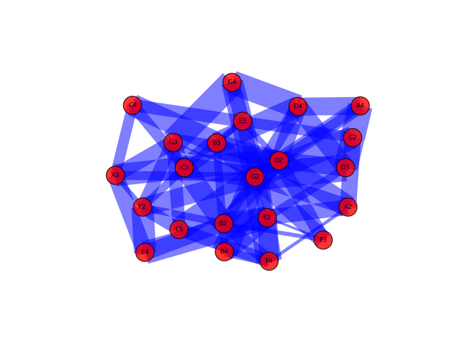

# Computational Rock: Opus 3

[Cellular automata](automata.py) create [rythm patterns](groove.py).
[Melodies](melody.py) are created random-walking a complex network
created with the grades from a given scale as nodes.

## Binary Count Cellular Automata

Binary count from 0000 to 1111 would go like:

| base 10 | base 2 |
-------|-------|
| 0 | 0000 |
| 1 | 0001 |
| 2 | 0010 |
| 3 | 0011 |
| 4 | 0100 |
| 5 | 0101 |
| 6 | 0110 |
| 7 | 0111 |
| 8 | 1000 |
| 9 | 1001 |
|10 | 1010 |
| etc. | etc. |

For a time resolution of a sixteenth of a whole note sixteen bits can
be used: from 0000000000000000 to 1111111111111111, which is 65,536 in
base 10 (1024*64).

### Grouping by number of Transitions

All numbers in the sixteen bit series are classified and grouped by
counting transitions from 0 to 1 or from 1 to 0. For example:
1111111111111111 and 0000000000000000 have zero transitions while
1111111100000000 and 0000000011111111 have one, 1100110011001100 has
seven and 0101010101010101 has fifteen.

Plots are done by painting black pixels for zeroes and white pixels
for ones. Each complete group can be seen plotted
[here](plots/transition_automata/).

They look great, check out the symmetry!

### Grouping by shade

If zeroes are painted black, numbers with more zeroes are shadier. All
numbers in the sixteen bit series are classified by shade. For example
0000000000000000 is in group sixteen while 0000000011111111 and
0000111100001111 are in group eight.

Plots for each complete group can be seen [here](plots/shade/).

## Melody generator

Melodies are created random walking random networks of different topologies.

Barabasi-Albert

Erds-Renyi

Strogatz

